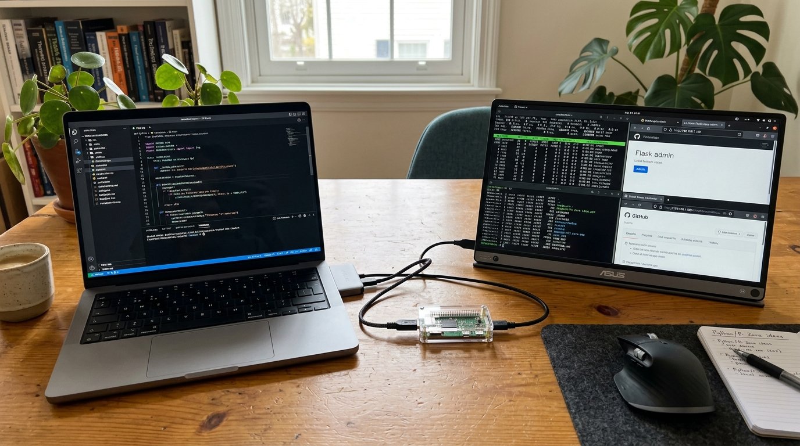
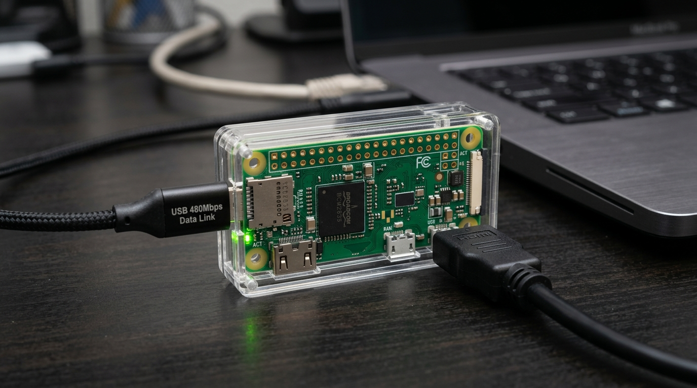

# ext-monitor: Universal Low-Latency USB Display & Multimedia Appliance Engine

> [🇧🇷 Versão em Português (Brasil)](README.pt-BR.md) | 🇺🇸 English Version

[](LICENSE)
[](https://www.rust-lang.org/)
[](https://www.raspberrypi.com/)
[]()
[]()
[](http://192.168.7.2:8080/swagger)
[](https://github.com/programandosolucoes/ext-monitor/releases/tag/v2.3.0-final)

A high-performance, 100% native Rust system designed to transform a modest **Raspberry Pi Zero (v1.2 / v1.3 / W / Zero 2 W)** connected via a single standard **Micro-USB cable** into a **zero-latency hardware HDMI secondary display, digital audio sink, real-time audio spectrum visualizer, and IoT media appliance** for Linux (Wayland / GNOME Mutter) and Windows 10/11 (native Miracast / `Win + K`).

Delivers fluid **30 to 60 FPS** at native resolution (1280x720 / 1600x900) with **sub-millisecond latency (< 1 ms via USB Bulk / < 15 ms via UDP)** and **~0.8% CPU load** on the Pi Zero through zero-copy GPU offloading (Broadcom VideoCore IV V4L2 M2M hardware decoder + KMS/DRM overlay scanout, driven by AMD VA-API, NVIDIA NVENC, or Intel QSV hardware encoding on the host).

---



---

## 💡 Author's Motivation, The Silicon Challenge & What It Offers

### The Motivation
Developers, engineers, and digital nomads constantly struggle with screen real estate. Commercial portable USB monitors cost upwards of $200–$400, add physical bulk to laptop bags, and standard software-based display mirrors (such as Duet Display or Spacedesk) either lack native Linux/Wayland support, suffer from sluggish mouse latency, or consume excessive host CPU.

The goal of this project was to prove that through uncompromising, bare-metal systems engineering in Rust, **an ultra-low-cost, widely accessible $10 board could be turned into a professional-grade, zero-latency secondary display and IoT multimedia appliance**.

### The Hard Silicon Challenge
The Raspberry Pi Zero W is powered by the Broadcom BCM2835 SoC:
* **Single ARM1176JZF-S core** clocked at 1.0 GHz (32-bit ARMv6 architecture).
* **Only 512 MB of shared RAM** divided between CPU and GPU.
* **USB 2.0 controller (`dwc2`)** shared with system interrupts.

Running a generic desktop Linux distribution (like Raspberry Pi OS with X11 or Wayfire) consumes more than 350 MB of RAM just sitting idle, pegging the CPU at 100% and causing severe frame drops.

To achieve fluid 30–60 FPS video with digital audio and sub-millisecond response, **every standard abstraction had to be eliminated**:
1. **No X11, No Wayland on the Receiver:** The receiver runs bare-metal Linux with direct kernel DRM/KMS scanout and zero-copy DMA-BUF memory buffers.
2. **Single-Cable USB Gadget:** Power and high-speed data (480 Mbps) travel through one standard micro-USB cable.
3. **100% RAM Execution:** The entire operating system boots from a compressed 32 MB `initramfs`. The micro-SD card is never written to, completely eliminating SD card wear and corruption risks.
4. **Hardware Audio FFT Realtime Engine:** An integrated 512-point Cooley-Tukey FFT with Hann windowing processes live host audio into a 24-band spectrum visualizer displayed on the TV when desktop video is paused.

### What ext-monitor Offers:
* **True Physical Display Extension:** Exposes a virtual HDMI output in GNOME Wayland / Mutter or native Windows Wireless Display (`Win + K`). Windows and workspaces snap, drag, and maximize natively.
* **HDMI Digital Audio over PipeWire:** Direct host audio sink streaming 48kHz Opus audio directly to the secondary monitor or TV speakers via HDMI.
* **Single-HDMI Scanout Multiplexer:** Hardware-level mutual exclusion automatically switches the single HDMI port between PC desktop video, 30 FPS dynamic audio visualizer, and a multilingual 4-language splash screen.
* **IoT Media Renderer:** Supports casting media streams (Chromecast / DLNA / UPnP / AirPlay-like) directly to the appliance.
* **Interactive OpenAPI 3.0 / Swagger UI:** Full REST API documentation accessible in-browser at `http://192.168.7.2:8080/swagger`.
* **Zero-Reboot Architecture:** Seamless, non-blocking service switching between USB Bulk, UDP, and Wi-Fi without device reboots.

---

## 🔌 Hardware Setup & Correct Port Wiring

<p align="center">
  
</p>

### Port Pinout & Anti-Error Guide

```
                            [ 40-Pin GPIO Header ]
  +------------------------------------------------------------------------+
  | [Micro-SD Slot]                                                        |
  | (SanDisk Card)                [ BCM2835 SoC ]                          |
  |                                                                 [CSI]  |
  +---------[ mini-HDMI ]-----------[ Micro-USB OTG ]---------[ PWR IN ]---+
                   │                        │                     │
                   │                        │                     └── [LEAVE EMPTY!] DO NOT PLUG
                   │                        │                         (Host PC supplies 5V via OTG)
                   │                        └── Micro-USB to PC / Laptop USB Port
                   │                            (5V Bus Power + 480 Mbps Data Transport)
                   │
                   └── mini-HDMI Cable to Secondary Monitor or TV
```

* **mini-HDMI Port (Left):** Dedicated video and digital audio scanout to your secondary monitor or television.
* **Center Micro-USB Port (OTG / Data + Power):** Plugged directly into the host PC or laptop. Delivers 5V power and handles all data traffic (480 Mbps).
* **Right Micro-USB Port (PWR IN):** **MUST REMAIN EMPTY!** Do not attach an external power supply when connected to a computer to avoid ground loops.
* **Power Draw:** Only ~0.8W (safely within any standard USB 2.0 port power specification).
* **Operating Temperature:** ~44.5°C sustained load (zero thermal throttling).

---

## 🏗️ System Architecture

```
[ HOST PC (Linux Wayland / Windows / macOS) ]
  ├── Capture & Audio Pipelines:
  │     ├── Mutter Screencast D-Bus: Native Wayland display capture with Damage Pacer
  │     ├── PipeWire Audio Sink: Captures 48kHz PCM audio -> Opus stream (UDP 5004)
  │     └── Host Audio FFT Engine: 512-pt Cooley-Tukey FFT -> 24-band energy (UDP 5006)
  └── Rust `ext-sender` (Transmitter Engine):
        ├── Hardware Encoder: AMD VA-API, NVIDIA NVENC, Intel QuickSync, or CPU x264
        ├── Continuous CFR Pacer: 30/60 FPS pacer eliminating video freezes
        └── Dual Transport: Raw USB Bulk FunctionFS (< 1 ms) or UDP RTP 5000 (< 15 ms)
              │
              ▼ [ Single Micro-USB OTG Cable / Network Link ]
              │
[ RECEIVER APPLIANCE (Raspberry Pi Zero W / BCM2835 VideoCore IV) ]
  └── Rust `ext-receiver` (Multi-Mode Display & Appliance Daemon):
        ├── Built-in Zero-Gateway DHCP Server: Assigns 192.168.7.1 to PC without breaking main Wi-Fi
        ├── Broadcom VideoCore IV Hardware VPU: H.264 V4L2 M2M decoder (`/dev/video10`)
        ├── HDMI Digital Audio: ALSA HDMI direct sink (`hw:0,0`)
        ├── Single-HDMI Scanout Multiplexer:
        │     ├── Priority 1: PC Desktop Screen (Direct KMS DRM DMA-BUF Zero-Copy)
        │     ├── Priority 2: 30 FPS Dynamic Audio FFT Visualizer (When video is paused)
        │     └── Priority 3: Multilingual 4-Language Splash Ready Screen (When idle)
        ├── IoT Media Renderer: UPnP / DLNA / Chromecast-like receiver mode
        ├── Multilingual Web UI: 4-language dashboard (EN, PT, IT, ZH) on port 8080
        └── Swagger UI: Interactive OpenAPI 3.0 documentation on `/swagger`
```

---

## 🔀 Five Universal Operating Modes

The appliance provides five concurrent, hot-switchable operating modes:

| Mode | Target Platform | Protocol / Transport | Latency | Application / Advantage |
| :--- | :--- | :--- | :---: | :--- |
| **Mode 1: Linux Wayland** | Linux (GNOME / KDE / Sway) | UDP 5000 (Video) + UDP 5004 (Audio) | **< 15 ms** | 30/60 FPS H.264 + 48kHz HDMI Digital Audio, hot-apply bitrate & volume |
| **Mode 2: USB Bulk Direct** | High-Security / Low-Latency | USB FunctionFS (`0xFF` Bulk) | **< 1 ms** | **Sub-millisecond latency.** Bypasses TCP/IP completely; immune to network congestion |
| **Mode 3: Windows Miracast** | Windows 10 / 11 | RTSP Port 7236 (Wi-Fi Display) | **~30 ms** | Zero drivers required on Windows; connect using native **`Win + K`** |
| **Mode 4: TCP Robust Stream** | Corporate Networks | TCP / RFC 4571 Framing | **30–45 ms** | Works reliably in corporate environments with strict UDP filtering |
| **Mode 5: IoT Media Renderer** | Mobile & IoT Devices | UPnP / DLNA / HTTP Media | **50–100 ms** | Cast videos, music, and streams directly to your TV without desktop casting |

---

## ⚡ Quick Start & Usage

### 1. One-Click Linux Connection (Zero Installation)
On any Linux PC, plug the micro-USB cable into the center OTG port and run:
```bash
curl -sSL http://192.168.7.2:8080/connect.sh | bash
```

### 2. Manual CLI Transmitter Launch
```bash
# Extend desktop at 30 FPS, Economy color mode, 400 kbps (recommended):
./scripts/start.sh extend auto 30 false economy --bitrate=400

# Full 24-bit TrueColor mode with VA-API hardware encoding:
./scripts/start.sh extend vaapi 30 false full --bitrate=1500

# Mirror primary display (clone mode) at 60 FPS:
./scripts/start.sh clone auto 60

# Stream exclusively over USB Bulk Direct mode:
./scripts/start.sh extend bulk 30 false full
```

### 3. Native Windows 10 / 11 Setup
1. Connect the Raspberry Pi Zero micro-USB cable to your Windows PC.
2. Press **`Win + K`** on your keyboard.
3. Select **"Pi Zero Wireless Display"** from the Cast menu. Windows negotiates the connection automatically.

---

## 🌐 Web Control Panel, Audio Visualizer & Swagger API

Access `http://192.168.7.2:8080` from any browser on your network to manage the appliance:

* **Tab 1: Monitoring & Telemetry:** Real-time SoC temperature, CPU load, free RAM, and active mode toggle switches.
* **Tab 2: Stream Optimization:** Live sliders for Bitrate (150k to 15M), Framerate (15, 30, 60 FPS), Color Profiles, **HDMI Digital Audio Volume (0-100%)**, and Mute toggle.
* **Tab 3: Real-Time Audio Spectrum Canvas:** Interactive 30 FPS `<canvas>` visualizer displaying 24 logarithmic audio frequency bands and stereo L/R VU meters in real time.
* **Tab 4: Client Tool Downloads:** Instant downloads for standalone `ext-sender` binaries, portable `client.tar.gz`, `connect.sh`, and `99-ext-monitor.rules`.
* **Tab 5: Micro-SD & Firmware Upgrade:** Safely mount `/mnt/boot` directly over USB to upgrade firmware binaries without removing the SD card from the Pi.
* **Interactive OpenAPI 3.0 / Swagger UI:** Explore and test all endpoints directly at `http://192.168.7.2:8080/swagger`.

---

## 📊 Technical Benchmark & Comparison

| Solution | Framerate | Latency | Pi Zero CPU Load | Screen Tearing | Kernel Stability |
| :--- | :---: | :---: | :---: | :---: | :--- |
| **GUD USB Display (Legacy)** | 5–12 FPS | > 250 ms | **100% (choked)** | Severe tearing | Mutter atomic commit failure |
| **VNC / RDP Mirror** | 15–25 FPS | 80–150 ms | **75–90%** | Block artifacts | Not recognized as physical DRM output |
| **ext-monitor (Rust + VA-API + VideoCore IV)** | **60 FPS** | **< 1 ms (Bulk) / < 15 ms (UDP)** | **~0.8%** | **Zero Tearing** | **100% native Wayland & Windows integration** |

---

## 🚀 Multi-Device Deployment Guide

### 1. Cross-Compilation for Raspberry Pi Zero (ARMv6)
The BCM2835 SoC on Pi Zero v1.2/v1.3/W requires targeting the `armv6l` instruction set:
```bash
# Using cross (Docker-based):
cargo install cross --git https://github.com/cross-rs/cross
cd receiver && cross build --target arm-unknown-linux-musleabihf --release

# The compiled binary is located at: target/arm-unknown-linux-musleabihf/release/ext-receiver
```

### 2. Using Non-OTG Raspberry Pi Models (Pi 2, 3, 4, 5)
Models with standard USB host hubs do not support peripheral OTG gadget mode. Stream over Ethernet or Wi-Fi:
1. In `config.txt`, disable `dtoverlay=dwc2`:
   ```ini
   # dtoverlay=dwc2
   dtoverlay=vc4-kms-v3d,cma-128
   dtparam=audio=on
   ```
2. In `cmdline.txt`, remove `modules-load=dwc2` and append `ip=dhcp`.
3. Connect pointing to the Pi's local network IP:
   ```bash
   ./scripts/start.sh extend auto 60 false full <PI_IP_ADDRESS>:5000
   ```

### 3. Turning Any Secondary PC / Laptop into a Receiver
Any secondary computer running Linux, Windows, or macOS can act as a receiver without a Raspberry Pi:

#### Option A: GStreamer
```bash
gst-launch-1.0 -v udpsrc port=5000 buffer-size=524288 \
    caps="application/x-rtp,media=video,clock-rate=90000,encoding-name=H264,payload=96" ! \
    rtph264depay ! h264parse ! avdec_h264 ! autovideosink sync=false
```

#### Option B: FFmpeg / ffplay (Universal low-latency)
```bash
ffplay -fflags nobuffer -flags low_delay -framedrop -strict experimental \
       -an -sn -sync ext -protocol_whitelist file,udp,rtp \
       -i rtp://0.0.0.0:5000
```

#### Option C: MPV Player
```bash
mpv --no-cache --untimed --no-correct-pts --fps=60 --profile=low-latency --hwdec=auto rtp://0.0.0.0:5000
```

---

## 📖 Operation Manuals & Engineering Blueprints

* **[English Operation Manual (docs/OPERATION-MANUAL.md)](docs/OPERATION-MANUAL.md):** Complete operational manual in English covering all scripts, modes, PipeWire audio, CLI flags, telemetry, and zero-reboot switching.
* **[Manual de Operação em Português (docs/MANUAL-DE-OPERACAO.md)](docs/MANUAL-DE-OPERACAO.md):** Guia operacional exaustivo em português.
* **[The Book of Ext-Monitor: 20 Engineering Blueprints (docs/LIVRO-EXT-MONITOR.md)](docs/LIVRO-EXT-MONITOR.md):** Comprehensive 20-chapter technical book detailing the reverse engineering, hardware architecture, and math behind the appliance.

### Index of Engineering Blueprints (100% English Suite)

1. **[Blueprint 01: 32MB Appliance Image & BCM2835 Geometry](docs/blueprints/en/01-32mb-image-bcm2835-geometry.md):** Boot ROM boundaries, sector alignment, and 2KB FAT16 formatting.
2. **[Blueprint 02: End-to-End Architecture vs. GUD](docs/blueprints/en/02-architecture-tx-rx-and-gud-comparison.md):** Silicon-level comparison with GUD and V4L2 M2M offloading.
3. **[Blueprint 03: Packet Transmission & Drop-on-Late](docs/blueprints/en/03-packet-transmission-drop-on-late-pipeline.md):** RFC 6184 NAL unit fragmentation and leaky ring buffer pacer.
4. **[Blueprint 04: PipeWire & Suspend/Resume Recovery](docs/blueprints/en/04-pipewire-mutter-screencast-and-wayland.md):** Dual Rust watchdogs for instant recovery after PC S3 sleep.
5. **[Blueprint 05: CPU/GPU Optimization & Scalers](docs/blueprints/en/05-cpu-optimizations-rust-gpu-vpu-cas-scaler.md):** ARM1176 compiler flags, VA-API/NVENC zero-copy, and CAS edge-sharpening filters.
6. **[Blueprint 06: Concurrent Modes & USB ConfigFS Super-Gadget](docs/blueprints/en/06-concurrent-operating-modes-usb-gadget.md):** FunctionFS endpoint allocation and dynamic composite gadget creation.
7. **[Blueprint 07: Micro-SD Protection & USB In-Situ Upgrades](docs/blueprints/en/07-sd-card-in-ram-and-usb-upgrade.md):** Pure RAM execution, zero flash wear, and USB-mounted firmware upgrades.
8. **[Blueprint 08: Installation Manual & Multi-Distro Host Setup](docs/blueprints/en/08-host-installation-and-portability-manual.md):** One-liner deployment, udev rules, and USB serial ACM recovery.
9. **[Blueprint 09: Empirical Hardware Tests & Boot Diagnostics](docs/blueprints/en/09-empirical-hardware-tests-boot-diagnostics.md):** VideoCore IV rainbow splash diagnostics and 1.8s boot timeline.
10. **[Blueprint 10: Modular Rust Clean Code & V4L2 M2M State Machine](docs/blueprints/en/10-modular-clean-code-v4l2-m2m-au-framing.md):** Refactored Rust pipeline, AU alignment, and V4L2 state machines.
11. **[Blueprint 11: KMS DRM DMA-BUF Zero-Copy & EFAULT Resolution](docs/blueprints/en/11-kms-drm-dma-buf-scanout-zero-copy-efault-fix.md):** Resolving errno 14 (EFAULT), pre-allocated DRM arrays, and zero-copy scanout.
12. **[Blueprint 12: Multilingual Splash, Realtime EDID & Teardown](docs/blueprints/en/12-multilingual-splash-realtime-edid-teardown.md):** 4-language onboarding splash, live EDID telemetry, and graceful disconnection.
13. **[Blueprint 13: Direct Kernel DRM/KMS Capture & Dual-Engine](docs/blueprints/en/13-direct-kernel-drm-kms-capture-dual-engine.md):** Atomic PRIME DMA-BUF extraction via ioctl GETFB2.
14. **[Blueprint 14: HDMI Digital Audio Subsystem, Opus & ALSA](docs/blueprints/en/14-digital-hdmi-audio-opus-alsa-av-sync.md):** Ultra-low-latency (< 25 ms) stereo digital audio pipeline on port 5004.
15. **[Blueprint 15: Zero-Copy Pipeline, Wayland Quiescence & Display Lifecycle](docs/blueprints/en/15-zero-copy-pipeline-wayland-quiescence-display-lifecycle.md):** VA-API zero-copy preservation, KMS retention, and silent console isolation.
16. **[Blueprint 16: Wayland Quiescence Pacer & Universal Receivers](docs/blueprints/en/16-wayland-quiescence-pacer-cross-armv6-universal-receivers.md):** Continuous CFR 60 FPS pacer eliminating Mutter video freezing.
17. **[Blueprint 17: Bi-Directional Host Daemon, Rust D-Bus Screen Cast & Dynamic Topology](docs/blueprints/en/17-native-rust-host-agent-bidirectional-web-control.md):** Dynamic virtual monitor sizing, D-Bus screencast handshake, and bidirectional control.
18. **[Blueprint 18: Zero-Copy VA-API Pipeline, PipeWire HDMI Audio & Hot-Apply Engine](docs/blueprints/en/18-hybrid-audio-subsystem-network-opus-bluetooth-a2dp.md):** VA-API DMA-BUF capture, PipeWire audio routing, and live parameter modulation.
19. **[Blueprint 19: IoT Media Renderer, Chromecast/UPnP/DLNA & Web Visualizer](docs/blueprints/en/19-iot-media-renderer-chromecast-upnp-hdmi-visualizer.md):** Media streaming appliance mode, background player, and HDMI audio visualizer.
20. **[Blueprint 20: Single-HDMI Scanout Multiplexer, Realtime Hardware FFT & Zero-Reboot](docs/blueprints/en/20-single-hdmi-scanout-multiplexer-realtime-fft-i18n-zero-reboot.md):** 512-point Cooley-Tukey FFT, single-HDMI mutual exclusion, 4-language i18n, and zero-reboot teardown.

---

## 🛠️ Building the Appliance Image

To compile the entire system and build a bootable 32MB SD card image:
```bash
# Build complete universal appliance image (Pi Zero 1 & Zero 2 W) via native Rust tool:
ext-tool build --image

# Flash directly to micro-SD card (replace /dev/sdX with your card reader):
sudo ext-tool flash /dev/sdX
```

---

## 📄 License & Attribution

Distributed under the **MIT License**. See [LICENSE](LICENSE) for full details.

### Author & Contact
* **Author:** Carlos Alberto
* **E-mail:** [carlosalberto4ti@gmail.com](mailto:carlosalberto4ti@gmail.com)
* **LinkedIn:** [linkedin.com/in/carlosalberto4ti](https://www.linkedin.com/in/carlosalberto4ti)
* **Personal Blog & Portfolio:** [carloslopes.programandosolucoes.com.br](https://carloslopes.programandosolucoes.com.br)
* **Website:** [programandosolucoes.com.br](https://programandosolucoes.com.br)

