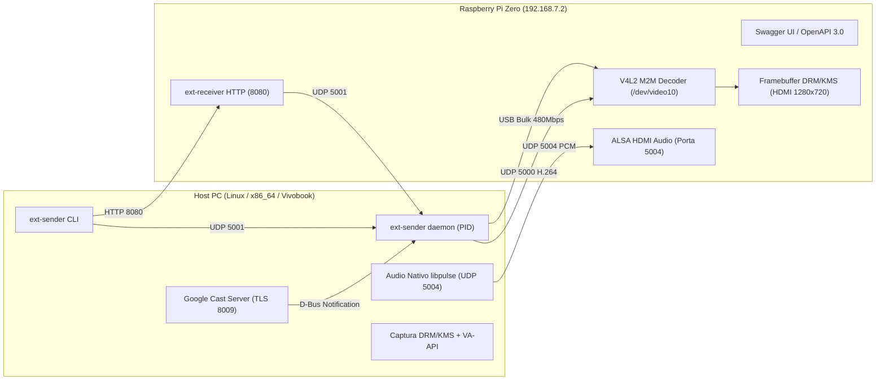

# Manual Técnico Operacional — ext-monitor

> **Regra de Ouro Arquitetural:**  
> **ZERO EDIÇÕES DE CÓDIGO FONTE PARA OPERAÇÕES DE ROTINA.**  
> Qualquer transição de modo (Modo 1 Rede UDP, Modo 2 Miracast, Modo 3 USB Bulk ou Standby), ajuste de topologia (Estender vs Clonar) ou configuração de áudio/vídeo DEVE ser realizada estritamente pelas interfaces públicas:
> 1. **Linha de Comando (CLI):** `ext-sender switch ...` ou `ext-sender mode ...`
> 2. **API REST HTTP:** `http://192.168.7.2:8080/api/...`
> 3. **Painel Web SPA:** `http://192.168.7.2:8080`

---

## 1. Visão Geral da Arquitetura

O sistema opera com um modelo bidirecional distribuído entre o Host PC (transmissor) e o Raspberry Pi Zero (receptor/display):



---

## 2. Comandos de Linha de Comando (Host CLI)

O binário `/usr/local/bin/ext-sender` provê controle unificado. Quando o serviço em segundo plano está em execução, qualquer invocação CLI comunica-se via socket de controle local (UDP 5001) e sincroniza o Pi Zero (HTTP 8080).

### 2.1 Alternância de Transporte (`switch`)

| Ação Desejada | Comando CLI | Protocolo / Destino |
| :--- | :--- | :--- |
| **Modo 3 (USB Bulk)** | `ext-sender switch usb-bulk` | USB FunctionFS 480 Mbps (< 1ms latência) |
| **Modo 3 (USB Bulk + Clonar)** | `ext-sender switch usb-bulk --mode=clone` | Clona eDP-1 no HDMI via USB Bulk |
| **Modo 1 (Rede UDP)** | `ext-sender switch network` | UDP H.264 porta 5000 / RFC 4571 (< 15ms) |
| **Modo 1 (Rede UDP + Estender)** | `ext-sender switch network --mode=extend` | Estende tela HDMI-1 via UDP |
| **Modo 2 (Miracast)** | `ext-sender switch miracast` | Prepara RTSP 7236 e MS-MICE 7250 (Win + K) |
| **Standby (Repouso TV)** | `ext-sender switch standby` | Pausa stream e exibe Splash Screen na TV |

*(Atalhos numéricos também são aceitos: `ext-sender switch 3`, `ext-sender switch 1`, `ext-sender switch 2`).*

### 2.2 Topologia de Tela (`mode`)

| Ação Desejada | Comando CLI | Comportamento |
| :--- | :--- | :--- |
| **Estender Área de Trabalho** | `ext-sender mode extend` | Projeta área de trabalho estendida no HDMI-1 |
| **Clonar Tela Principal** | `ext-sender mode clone` | Espelha o display primário do notebook (eDP-1) |
| **Configurar Perguntar no Cast** | `ext-sender mode ask` | Diálogo D-Bus dispara **apenas** no Chrome Cast |

### 2.3 Status e Gerenciamento do Serviço

| Operação | Comando CLI |
| :--- | :--- |
| **Verificar Status Operacional** | `ext-sender status` |
| **Acompanhar Logs em Tempo Real** | `ext-sender logs` |
| **Reiniciar Serviço no Host** | `ext-sender service start` |
| **Parar Serviço no Host** | `ext-sender service stop` |

---

## 3. Guia da API REST HTTP (Pi Zero - Porta 8080)

O appliance responde em `http://192.168.7.2:8080`. Documentação Swagger interativa em:
- **Swagger UI:** `http://192.168.7.2:8080/swagger`
- **OpenAPI 3.0 JSON:** `http://192.168.7.2:8080/api/openapi.json`

### 3.1 Chaveamento Atômico de Transporte (`/api/transport/active`)

```bash
# Ativar Modo 3 (USB Bulk Direto)
curl -X POST http://192.168.7.2:8080/api/transport/active \
  -H "Content-Type: application/json" \
  -d '{"active_transport":"mode3_usb_bulk","transport":"usb_bulk","action":"start"}'

# Ativar Modo 1 (Rede UDP 5000)
curl -X POST http://192.168.7.2:8080/api/transport/active \
  -H "Content-Type: application/json" \
  -d '{"active_transport":"mode1_udp","transport":"network","action":"start"}'

# Ativar Modo 2 (Windows Miracast RTSP 7236)
curl -X POST http://192.168.7.2:8080/api/transport/active \
  -H "Content-Type: application/json" \
  -d '{"active_transport":"mode2_miracast","transport":"miracast","action":"stop"}'

# Entrar em Standby (Splash Screen na TV)
curl -X POST http://192.168.7.2:8080/api/stream/stop
```

### 3.2 Controle do Host Transmitter (`/api/host/control`)

```bash
# Solicitar ao host estender a tela via USB Bulk
curl -X POST http://192.168.7.2:8080/api/host/control \
  -H "Content-Type: application/json" \
  -d '{"action":"start","mode":"extend","transport":"usb_bulk"}'

# Solicitar ao host clonar a tela via Rede UDP
curl -X POST http://192.168.7.2:8080/api/host/control \
  -H "Content-Type: application/json" \
  -d '{"action":"start","mode":"clone","transport":"network"}'

# Parar transmissão do host (repouso)
curl -X POST http://192.168.7.2:8080/api/host/control \
  -H "Content-Type: application/json" \
  -d '{"action":"stop"}'
```

### 3.3 Telemetria e Monitoramento em Tempo Real

```bash
# Telemetria geral (temperatura SoC, uso CPU, RAM livre, estado do stream e Árbitro de Hierarquia HDMI)
curl -s http://192.168.7.2:8080/api/status | jq .
# Exemplo de resposta:
# {
#   "temp": "44.4",
#   "cpu": "0.31%",
#   "ram": 287,
#   "stream_state": "active",
#   "hierarchy": {
#     "level": 0,
#     "level_name": "Level 0: Desktop Streaming (mode3_usb_bulk)",
#     "display_owner": "KMS Plane 86",
#     "visualizer_enabled": false
#   }
# }

# Clocks reais de hardware do SoC via DebugFS (ARM, VPU, H.264, SDRAM)
curl -s http://192.168.7.2:8080/api/debug/clocks | jq .

# Estado do endpoint USB Gadget FunctionFS e interface de rede usb0
curl -s http://192.168.7.2:8080/api/debug/usb | jq .

# Status do transmissor Host PC
curl -s http://192.168.7.2:8080/api/host/status | jq .
```

### 3.4 Controle de Áudio Digital HDMI

```bash
# Consultar status do áudio (volume, mute, taxa ALSA)
curl -s http://192.168.7.2:8080/api/audio/status | jq .

# Ajustar volume do HDMI (0 a 100)
curl -X POST http://192.168.7.2:8080/api/audio/volume \
  -H "Content-Type: application/json" \
  -d '{"volume":85}'

# Silenciar / Reativar som
curl -X POST http://192.168.7.2:8080/api/audio/mute \
  -H "Content-Type: application/json" \
  -d '{"muted":false}'

# Configurar taxa de amostragem ALSA (44100, 48000, 96000)
curl -X POST http://192.168.7.2:8080/api/audio/rate \
  -H "Content-Type: application/json" \
  -d '{"rate":48000}'
```

### 3.5 Captura Visual do Framebuffer (Screenshot)

```bash
# Baixar quadro atual renderizado no HDMI (/dev/fb0 ou último buffer decodificado)
curl -s http://192.168.7.2:8080/api/screenshot -o fb_capture.raw
```

---

## 4. Comportamento do Google Chrome Cast vs Painel Web e CLI

### 4.1 O Princípio do Não-Sobrescrita
- **Painel Web:** O usuário clica explicitamente em botões ("🖥️ Estender", "💻 Clonar", "Modo 3 USB", "Modo 1 Rede"). O sistema executa a intenção **diretamente**, sem abrir popups de confirmação na área de trabalho.
- **CLI (`ext-sender`):** Comandos por terminal possuem intenção explícita e nunca abrem diálogos gráficos.
- **Google Chrome Cast (LAUNCH):** É a **ÚNICA** fonte de sinal que invoca o diálogo interativo do desktop (`dialog.rs`).

### 4.2 Robustez do Diálogo Modal (Zenity + D-Bus Fallback)
Quando o Chrome Cast inicia:
1. **Janela Modal em Primeiro Plano:** Utiliza `zenity --question` com janela nativa do desktop que retém foco e não se esconde sob outras janelas.
2. **Temporizador de 30 Segundos:** Contagem regressiva visível com cancelamento automático se inativo.
3. **Botão de Cancelamento Dedicado:** Permite abortar imediatamente sem alterar o layout das telas.
4. **Fallback Suave:** Caso o `zenity` não esteja instalado, utiliza D-Bus Notification crítico residente.

---

## 5. Tabela de Portas e Protocolos

| Porta | Protocolo | Direção | Finalidade |
| :--- | :--- | :--- | :--- |
| **8080** | TCP | Host -> Pi Zero | API REST, Swagger UI, Web Dashboard SPA |
| **5001** | UDP | Pi -> Host / Local | Socket de controle bidirecional (`ControlAction`) |
| **5000** | UDP | Host -> Pi Zero | Stream de vídeo H.264 (Modo 1 Rede UDP) |
| **5004** | UDP | Host -> Pi Zero | Stream de áudio PCM / Opus (HDMI TV) |
| **7236** | TCP | Host -> Pi Zero | RTSP Handshake para Windows Miracast (Modo 2) |
| **7250** | TCP | Host -> Pi Zero | MS-MICE WiFi Display Over Infrastructure |
| **8009** | TCP (TLS) | Chrome -> Host | Google Cast V2 Handshake e TLS Authentication |
| **USB Bulk** | FunctionFS | Host -> Pi Zero | Transporte direto H.264 USB 480 Mbps (Modo 3) |

---

## 6. Procedimento de Benchmark e Validação

Ao executar benchmarks de reprodução (ex.: Pluto TV em tela cheia com áudio):
1. **USB Bulk + Áudio:**  
   `ext-sender switch usb-bulk --mode=extend`  
   Aguarde 2 segundos. Verifique telemetria via `curl -s http://192.168.7.2:8080/api/status`.
2. **Rede UDP + Áudio:**  
   `ext-sender switch network --mode=extend`  
   Aguarde 2 segundos. Verifique telemetria via `curl -s http://192.168.7.2:8080/api/status`.
3. **Miracast + Áudio:**  
   `ext-sender switch miracast`  
   Conecte via cliente Miracast (`ext-miracast` ou `gnome-network-displays`).
4. **Retorno a Repouso:**  
   `ext-sender switch standby`

---

## 7. Versão Congelada v2.8.0-final

- **Bateria de Testes:** 100% verde em todo o workspace (`cargo test --workspace`) com 160 testes unitários cobrindo árbitro de serviços, parser de ações, pipelines e micro-blocos.
- **Tag Git:** `v2.8.0-final`
- **Release:** Congelamento final e blindagem de arquitetura.

---

## 8. Versão Congelada v2.9.0-final: Idempotência de Transporte, Desacoplamento de Áudio e Pure Rust Splash

- **Tag Git Oficial:** `v2.9.0-final`
- **Proteção Estrita de Idempotência:** Eliminação definitiva de travamentos de pipeline/USB por duplo clique. Comandos repetidos de início, transporte ou topologia enquanto o fluxo já está ativo são descartados com segurança no UI, Receiver e Sender supervisor.
- **Unificação da Interface Web (Aba 1):** Consolidação dos botões de controle em card único para Modos 1 (UDP), 2 (Miracast), 3 (USB Bulk) e Standby, com seletor independente de áudio simultâneo/desacoplado.
- **Blindagem do GNOME Mutter:** Uso de `META_MONITORS_CONFIG_METHOD_PERSISTENT` (método 2) no `ApplyMonitorsConfig`, eliminando por completo os diálogos modais de confirmação ("Manter essa tela") ao estender ou recolher monitores.
- **Gerador de Splash 100% Pure Rust:** Substituição do script Python legado por rasterizador tipográfico em Rust puro via `fontdue` e compressão Gzip `miniz_oxide`, acoplado diretamente ao `cargo build` (`receiver/build.rs`) e CLI `ext-tool splash`.
- **Testes Unitários:** 100% verde (142 testes passando em todo o workspace).

