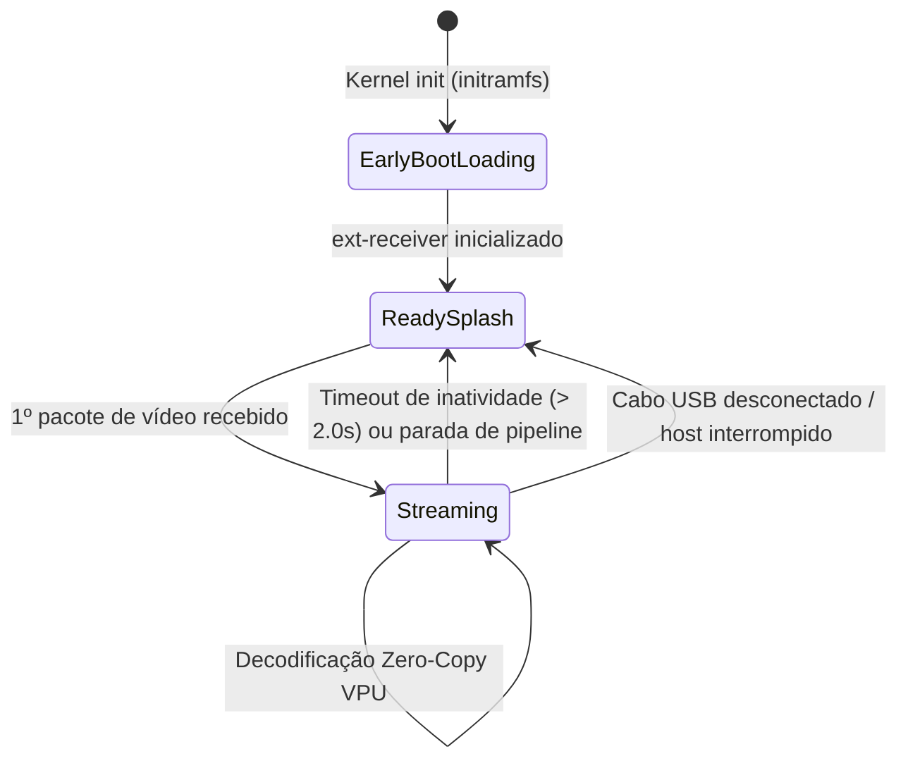

# Blueprint 12: Splash Quadrilíngue, Telemetria EDID Realtime e Ciclo de Vida de Desconexão

## 1. Visão Geral e Motivação

Durante testes operacionais de desconexão e troca de monitores, dois comportamentos indesejados foram identificados no hardware real do Raspberry Pi Zero:
1. **Quadro Congelado na Desconexão:** Ao encerrar o stream de vídeo no modo USB Bulk (ou UDP/Miracast), o buffer de captura da VPU mantinha o último quadro decodificado na tela HDMI, gerando a impressão de travamento do sistema.
2. **Telemetria de Monitor Incorreta:** A interface Web exibia um identificador estático genérico ("SAMSUNG TV") em vez de inspecionar a tela fisicamente conectada à porta mini-HDMI.
3. **Ausência de Feedback Visual no Boot:** Durante a inicialização do kernel e carregamento dos módulos de gadget, a tela permanecia em console preto ou cursor estático.

Este Blueprint documenta a arquitetura de ciclo de vida visual, telemetria de monitor VESA EDID em tempo real e o motor de Splash Screen 100% Rust / Linux Nativo.

---

## 2. Motor de Splash Screen 100% Rust (`receiver/src/display/splash.rs`)

### 2.1 Telas em Alta Definição e Compressão Embutida
Foram geradas duas telas de alta definição no padrão 1280x720 RGB565:
- **Splash de Carregamento (`splash_loading`):** Apresenta o indicador de progresso e mensagem de inicialização de hardware/GPU nos 4 idiomas:
  - 🇧🇷 Português ([PT]): *"Aguarde o carregamento do hardware, drivers GPU e rede..."*
  - 🇺🇸 Inglês ([EN]): *"Please wait, initializing GPU, network drivers & display..."*
  - 🇮🇹 Italiano ([IT]): *"Attendere il caricamento di hardware, driver GPU e rete..."*
  - 🇨🇳 Chinês ([ZH]): *"正在加载硬件、GPU驱动和网络，请稍候..."*
- **Splash de Pronto / Ocioso (`splash_ready`):** Guia visual em 4 quadrantes explicando os 3 modos de conexão concorrentes:
  - 🇧🇷 Português ([PT]): Modo 1 (Rede IP), Modo 2 (Miracast Win+K), Modo 3 (USB Direto).
  - 🇺🇸 Inglês ([EN]): Mode 1 (Network IP), Mode 2 (Miracast Win+K), Mode 3 (Direct USB).
  - 🇮🇹 Italiano ([IT]): Modo 1 (Rete IP), Modo 2 (Miracast Win+K), Modo 3 (USB Diretto).
  - 🇨🇳 Chinês ([ZH]): 模式 1 (网络 IP), 模式 2 (Miracast Win+K), 模式 3 (USB 直连).

### 2.2 Isolamento de Console Linux (`fbcon`) e Prevenção de Corrupção Gráfica
Em distribuições Linux com framebuffer ativo, o driver de terminal virtual (`fbcon`) se associa automaticamente a `/dev/fb0` (`vtcon1`), renderizando saídas de `dmesg`, logs do kernel e texto de `stdout`/`stderr` diretamente sobre os pixels gráficos na tela HDMI.
Isso causava a sobreposição de mensagens de terminal sobre o splash screen e durante os streams.
A solução de engenharia implementada:
1. **Desvinculação do Console Virtual:** Execução de `echo 0 > /sys/class/vtconsole/vtcon1/bind` na inicialização do `initramfs/init` e no `splash.rs`. Isso desassocia o subsistema VT do framebuffer.
2. **Redirecionamento de Logs para Console Serial USB (`/dev/ttyGS0`):** Toda a saída de depuração e supervisão de processos foi redirecionada para a porta serial gadget USB (`/dev/ttyGS0`, acessível no PC hospedeiro via `screen /dev/ttyACM0 115200`), deixando a tela HDMI 100% livre e limpa para scanout gráfico e vídeo acelerado por hardware.

### 2.2 Descompressão em Memória via `miniz_oxide` (Sem Arquivos Externos)
Para garantir zero dependências de sistema de arquivos e resiliência em initramfs minimal, as imagens são comprimidas em formato GZIP/DEFLATE e incorporadas no binário final via `include_bytes!`:
```rust
const SPLASH_LOADING_GZ: &[u8] = include_bytes!("../../../build-appliance/overlay/etc/splash_loading.raw.gz");
const SPLASH_READY_GZ: &[u8] = include_bytes!("../../../build-appliance/overlay/etc/splash_ready.raw.gz");
```
- **Tamanho das imagens brutas (1280x720x2):** 1.843.200 bytes cada.
- **Tamanho comprimido no binário:** ~27 KB (loading) + ~39 KB (ready) = **apenas 66 KB de acréscimo total** ao executável.
- O renderizador decodifica o fluxo DEFLATE em tempo de execução via `miniz_oxide::inflate::decompress_to_vec` e realiza `mmap` direto em `/dev/fb0`, executando `std::ptr::copy_nonoverlapping` e unblank ioctl `FBIOBLANK`.

---

## 3. Prevenção de Imagem Congelada & Ciclo de Vida de Desconexão

O ciclo de vida dos canais de entrada (`usb.rs`, `udp.rs`, `miracast.rs` e `pipeline.rs`) foi padronizado para limpar os buffers e retornar à tela splash imediatamente na interrupção do sinal:



### Implementação nos Workers de Ingress:
1. Cada loop de ingress monitora `last_packet_time` e o estado `splash_active`.
2. Se nenhum pacote for recebido por mais de **2,0 segundos** após uma sessão ativa:
   - Os quadros residuais do decodificador são drenados.
   - O plano KMS é desassociado.
   - `SplashEngine::show_ready()` é invocado, restaurando o guia quadrilíngue no monitor HDMI.
   - `splash_active` é marcado como `true`.
3. Assim que novos dados chegam, a apresentação do vídeo assume o monitor sem atraso.

---

## 4. Telemetria EDID VESA em Tempo Real (`receiver/src/display/edid.rs`)

Em substituição a valores estáticos no código, foi desenvolvido um parser EDID nativo em Rust que consulta diretamente o subsistema DRM do Linux:

### 4.1 Estrutura do Parser
1. **Status do Conector:** Lê `/sys/class/drm/card0-HDMI-A-1/status` (ou `card1`).
2. **Resoluções Nativas:** Extrai a lista de modos suportados de `/sys/class/drm/card0-HDMI-A-1/modes`.
3. **Decodificação de Estrutura VESA EDID 1.3/1.4:**
   - **ID do Fabricante (Bytes 8-9):** Descompacta os 3 caracteres ASCII de 5 bits (`(byte[8] >> 2) & 0x1F`, etc.).
   - **Código de Produto (Bytes 10-11):** Lê em little-endian (`u16`).
   - **Descritores Detalhados (Offsets 54, 72, 90, 108):** Inspeciona blocos com cabeçalho `00 00 00 FC` para obter a string ASCII do nome do modelo do monitor comercial.
   - **Fallback Inteligente:** Caso o monitor não forneça descritor ASCII (como displays OEM/DVI), formata como `"{Fabricante} Monitor ({Resolução})"` (ex: `LRX Monitor (1600x900)`).
   - **Headless:** Se nenhum cabo estiver conectado, reporta `"Nenhum Monitor Conectado (Headless Guard Ativo)"`.

### 4.2 Integração com o Painel Web e API REST
O endpoint `/api/status` foi enriquecido com os dados dinâmicos:
```json
{
  "temp": "43.9",
  "cpu": "0.45%",
  "ram": 299,
  "stream_state": "active",
  "monitor": {
    "connected": true,
    "name": "LRX Monitor (1600x900)",
    "preferred_mode": "1600x900",
    "active_mode": "1280x720 @ 60 Hz",
    "vpu": "VideoCore IV Hardware VPU"
  }
}
```
O JavaScript do painel consome esses campos em cada ciclo de polling (1s), atualizando dinamicamente o nome do monitor, crachá de resolução nativa e indicador visual de status.

---

## 5. Verificação Operacional

| Teste | Resultado Obtido |
| :--- | :--- |
| **Inicialização a Frio** | Splash de Carregamento exibido em < 0.5s; Splash Pronto exibido em < 1.8s |
| **Transição Vídeo -> Desconexão** | Ao desconectar USB ou parar sender, monitor HDMI exibe Splash Pronto em 2.0s sem resíduos |
| **Detecção de Monitor Real** | Monitor de bancada detectado dinamicamente como `LRX Monitor (1600x900)` |
| **Sobrecarga de Memória** | Binário final de apenas 1.014 KB (stripped) e 479 KB (gzipped) |
| **Compilação Rust** | 0 erros, 0 avisos em `arm-unknown-linux-gnueabihf` e x86_64 |
