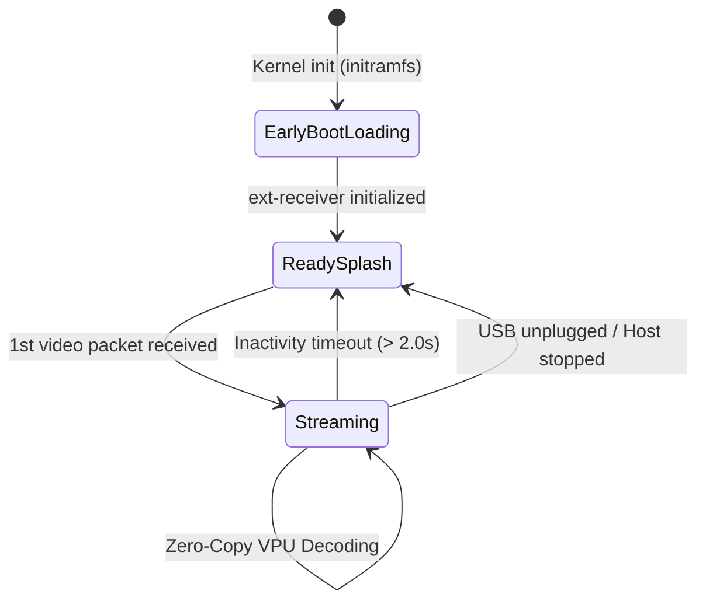

# Blueprint 12: Multilingual Splash Screen, Real-Time EDID Telemetry and Disconnection Lifecycle

> [🇧🇷 Versão em Português](../pt/12-splash-quadrilingue-telemetria-edid-realtime-e-ciclo-vida-desconexao.md) | 🇺🇸 English Version

**Project:** `ext-monitor`  
**Author:** Carlos Alberto <carlosalberto4ti@gmail.com>  
**Reference Files:** `receiver/src/display/splash.rs`, `receiver/src/display/edid.rs`, `tools/ext-tool/src/splash.rs`  
**Date:** September 2026 (Updated for v2.3.0 Universal Appliance)  

---

## 1. Overview and Operational Requirements

Hardware tests revealed critical UX requirements for headless embedded display operation:
1. **Frozen Frame on Disconnection:** When the host stopped streaming, the VPU capture buffer held the last decoded frame indefinitely, creating the illusion of a frozen board.
2. **Generic Monitor Telemetry:** Web dashboards reported hardcoded dummy monitor strings rather than inspecting physical HDMI EDID blocks.
3. **Black Screen During Boot:** The display remained blank while modules and network gadget drivers loaded.

This blueprint details the visual lifecycle, real-time VESA EDID parsing, and the native pure-Rust splash engine.

---

## 2. 100% Native Rust Splash Engine (`receiver/src/display/splash.rs`)

### 2.1 High-Definition 4-Language Display Splash Screens
Two 1280x720 RGB565 screens are embedded directly into the binary:
* **Loading Splash (`splash_loading`):** Displays hardware/GPU initialization status in 4 languages:
  - 🇧🇷 Portuguese: *"Aguarde o carregamento do hardware, drivers GPU e rede..."*
  - 🇺🇸 English: *"Please wait, initializing GPU, network drivers & display..."*
  - 🇮🇹 Italian: *"Attendere il caricamento di hardware, driver GPU e rete..."*
  - 🇨🇳 Chinese: *"正在加载硬件、GPU驱动和网络，请稍候..."*
* **Ready Splash (`splash_ready`):** 4-quadrant visual guide illustrating the 3 concurrent connection modes:
  - Mode 1: Network IP (`192.168.7.2:5000`)
  - Mode 2: Miracast (`Win + K`)
  - Mode 3: USB Bulk Direct (`FunctionFS`)

### 2.2 Virtual Console Isolation (`fbcon`)
To prevent Linux kernel `dmesg` logs from printing text over the splash screens or video scanout:
1. `/init` runs `echo 0 > /sys/class/vtconsole/vtcon1/bind` to unbind `fbcon` from `/dev/fb0`.
2. All debug logs are routed to the USB serial gadget (`/dev/ttyGS0`, accessible on the host via `/dev/ttyACM0`), preserving a clean HDMI display output.

### 2.3 GZIP In-Memory Decompression via `miniz_oxide`
Images are compressed as DEFLATE streams and included into the binary via `include_bytes!`:
```rust
const SPLASH_LOADING_GZ: &[u8] = include_bytes!("../../../build-appliance/overlay/etc/splash_loading.raw.gz");
const SPLASH_READY_GZ: &[u8] = include_bytes!("../../../build-appliance/overlay/etc/splash_ready.raw.gz");
```
* **Raw Image Size:** 1,843,200 bytes each.
* **Compressed Binary Footprint:** ~9 KB each (~18 KB total).
* Runtime decompression directly into `/dev/fb0` `mmap` occurs in milliseconds.

---

## 3. Disconnection Lifecycle & Anti-Freeze Teardown



If no video packet is received for > 2.0 seconds:
1. Decoder buffers are drained.
2. The KMS plane is unlinked.
3. `SplashEngine::show_ready()` restores the 4-language splash screen on the HDMI TV.

---

## 4. Real-Time VESA EDID Telemetry (`receiver/src/display/edid.rs`)

The embedded EDID parser queries the Linux DRM subsystem:
* **Connector Status:** Reads `/sys/class/drm/card0-HDMI-A-1/status`.
* **Modes:** Enumerates native display modes from `/sys/class/drm/card0-HDMI-A-1/modes`.
* **EDID VESA 1.3/1.4 Decoding:**
  - Extracts 3-character ASCII vendor ID (bytes 8–9).
  - Unpacks 16-bit little-endian product ID (bytes 10–11).
  - Parses ASCII detailed descriptor blocks (`00 00 00 FC`) to extract monitor model name (e.g. `LG Ultra HD`, `DELL P2419H`).
  - Integrates directly with `GET /api/status` for dynamic dashboard telemetry updates.
