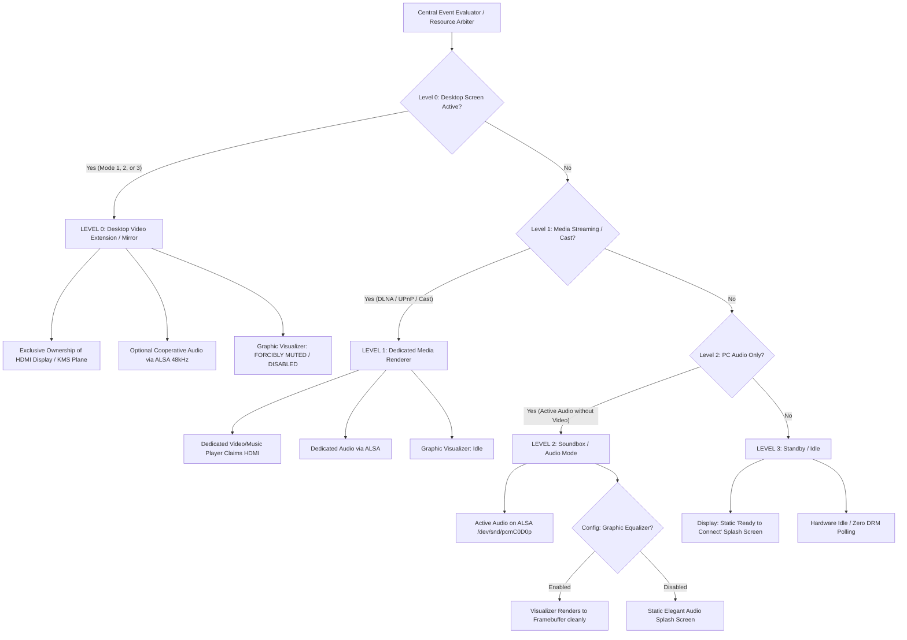

# Blueprint 34: Service Hierarchy, Decision Tree, and Micro-Block Architecture

**Status:** Approved for Implementation  
**Date:** October 03, 2026  
**Author:** Carlos Alberto & Antigravity AI  
**Target:** Raspberry Pi Zero W (ARMv6) / Zero 2 W (ARMv8) / Host PC (Linux/Windows)  

---

## 1. Context and Problem Statement

During empirical validation of runtime transport transitions (Mode 3 USB Bulk, Mode 1 Network UDP, Mode 2 Miracast, and Audio-only Mode), resource contention in the receiver's graphics subsystem was identified:
1. **DRM Master HDMI Contention:** Under the Linux `vc4-drm` driver, exactly one file descriptor may hold `DRM Master` status at any given time. When switching transports, if the preceding pipeline fails to formally release the KMS plane or if the background visualizer (`VisualizerEngine`) attempts writes to `/dev/fb0` while the V4L2 M2M decoder binds Plane 86 on CRTC 97, the driver throws `Plane update failed (Permission denied (os error 13))`. The decoder falls back to emulation framebuffer, but the prior KMS plane remains pinned in the foreground, freezing visual updates on the TV while audio continues playing.
2. **Visualizer vs. Service Splash Oscillation:** When audio packets arrived while video streaming was paused, the spectrum visualizer looped between rendering bars and re-displaying the service splash screen on silence intervals (> 800 ms).
3. **Requirement for Strict Decoupling:** Different functions (desktop screen extension, dedicated media streaming, standalone audio playback, and standby idle) must be orchestrated by a **deterministic, hierarchical decision tree**, where mutually exclusive resources are cleanly arbitrated and cooperative resources (such as synchronized audio alongside desktop video) function without monolithic coupling.

---

## 2. Service Hierarchy (Levels 0 through 4)

The architecture enforces a strict 4-level priority decision tree across all hardware resources:



### Level Specifications:

* **Level 0: Primary Desktop Screen Modes (Full Video Extension/Clone)**
  * **Modes:** Mode 3 (USB Bulk Direct), Mode 1 (Network UDP 5000), Mode 2 (Miracast WFD 7236).
  * **Video Priority:** **MAXIMUM (Exclusive)**. The V4L2 M2M hardware decoder and KMS presenter retain total control over CRTC 97 and Plane 86.
  * **Graphic Rules:** NO visualizer, equalizer, or splash renderer is permitted to touch `/dev/dri/card0` or `/dev/fb0`.
  * **Audio Rules:** Cooperative. Desktop PCM audio plays synchronously at 48,000 Hz without interfering with video frames.

* **Level 1: Dedicated Media Streaming / Cast (Non-Desktop)**
  * **Protocols:** Google Cast V2, UPnP / DLNA AVTransport, DIAL.
  * **Condition:** Active only when Level 0 is inactive (`None`).
  * **Behavior:** Media player claims dedicated video and audio renderers.

* **Level 2: Standalone PC Audio (HDMI Soundbox Mode)**
  * **Scenario:** Host PC routes audio (music, conferencing, browser audio) without video screen extension.
  * **Audio Behavior:** 48 kHz stereo PCM audio active on ALSA `/dev/snd/pcmC0D0p`.
  * **Video Behavior:** Display remains stable without flicker. Shows either a clean static audio splash screen or (if user explicitly enabled via `/api/media/visualizer {"enabled":true}`) the fluid FFT spectrum equalizer, without cycling to splash on silence.

* **Level 3: Standby / Idle**
  * **Scenario:** No video stream and no incoming audio packets.
  * **Behavior:** Displays static multilingual "Ready to Connect" splash screen; CPU usage drops below 1%.

---

## 3. Resource Matrix: Shared vs. Exclusive

| Hardware Resource | Sharing Policy | Level 0 (Desktop Screen) | Level 1 (Media Cast) | Level 2 (PC Audio) | Level 3 (Standby) | Handshake & Decoupling Procedure |
| :--- | :--- | :--- | :--- | :--- | :--- | :--- |
| **HDMI Display (`/dev/dri/card0`, KMS Plane 86)** | **Exclusive** | **Total Ownership** (V4L2 M2M DMA-BUF) | **Total Ownership** (Media Player) | Released to Framebuffer | Released to Splash | Prior owner executes atomic `release()` before ownership transfer, avoiding `os error 13 (Permission denied)`. |
| **HDMI Framebuffer (`/dev/fb0`)** | **Exclusive** | Disabled (prevents KMS collision) | Disabled | Active (Splash or Visualizer) | Active (Static Splash) | Guarded by Mutex during Level 0 to eliminate concurrent access with KMS plane. |
| **HDMI Audio (`/dev/snd/pcmC0D0p`)** | **Shared / Cooperative** | Active (Synced PC Audio) | Active (Cast/Media Audio) | Active (PC Audio) | Idle (Pre-warmed) | Independent audio thread consumes UDP 5004 without coupling to the video pipeline. |
| **USB Bulk (`/dev/usb-ffs/display`)** | **Ingress Exclusive** | Active in Mode 3 | Inactive | Inactive | Inactive | Clean worker termination without tearing down the UDC gadget controller. |
| **CDC-ECM Network (`usb0` 192.168.7.2)** | **Always Shared** | Active (Dashboard/API/Audio) | Active (Dashboard/API/Audio) | Active (Dashboard/API/Audio) | Active (Dashboard/API) | Persistent link; never unbound during video transport switches. |
| **REST API / Swagger (:8080)** | **Always Shared** | Active for management | Active for management | Active for management | Active for management | Central control and real-time telemetry router. |

---

## 4. Micro-Block Architecture

To prevent monolithic spaghetti code and maintain testability and traceability, every functional responsibility resides in its dedicated data-flow file:

```
receiver/src/flow/
├── mod.rs                        # Micro-block registration and orchestration
├── flow_hierarchy.rs             # Central Arbiter and State Machine (Levels 0..3)
├── flow_arbiter.rs               # Atomic HDMI Display / KMS Plane ownership manager
├── ingress_usb_bulk.rs           # Micro-block: FunctionFS USB Bulk reader (Mode 3)
├── ingress_network_udp.rs        # Micro-block: RTP H.264 UDP port 5000 reader (Mode 1)
├── ingress_miracast.rs           # Micro-block: RTSP/WFD port 7236 receiver & demuxer (Mode 2)
├── codec_v4l2_m2m.rs             # Micro-block: VideoCore IV hardware accelerated decoder
├── display_kms_plane.rs          # Micro-block: Direct DMA-BUF scanout on KMS plane (Zero-Copy)
├── display_framebuffer.rs        # Micro-block: /dev/fb0 manager and splash renderers
├── display_visualizer.rs         # Micro-block: Graphic equalizer (restricted strictly to Level 2)
├── audio_alsa_hdmi.rs            # Micro-block: ALSA HDMI IEC958 / 48 kHz renderer
└── audio_spectrum.rs             # Micro-block: FFT mathematical spectrum telemetry
```

And on the sender (`sender/src/flow/`):
```
sender/src/flow/
├── mod.rs                        # Sender micro-block registry
├── capture_kms_direct.rs         # Micro-block: Direct kernel DRM/KMS framebuffer capture
├── capture_pipewire.rs           # Micro-block: PipeWire / GNOME Mutter capture
├── encoder_vaapi.rs              # Micro-block: Hardware accelerated H.264 encoder
├── egress_usb_bulk.rs            # Micro-block: High-throughput USB Bulk writer
├── egress_network_udp.rs         # Micro-block: RTP UDP port 5000 transmitter
└── audio_streamer_native.rs      # Micro-block: In-process PulseAudio recorder & UDP 5004 streamer
```

---

## 5. Quality Assurance and Acceptance Criteria

1. **Compilation & Typing:** Standard Rust 2021 with zero critical warnings, cross-compiling cleanly for `arm-unknown-linux-musleabihf` (Pi Zero ARMv6) and building natively on `x86_64`.
2. **Unit Testing:** 100% test coverage over state transition matrices (`flow_hierarchy_tests.rs`), verifying that:
   - Level 0 unconditionally suppresses the visualizer and splash engines.
   - Level 2 supports smooth continuous audio without visual oscillation.
   - Mode 3 to Mode 1 transitions cleanly release and re-acquire KMS planes without `Permission denied`.
3. **Core Standard:** "Zero Code Edits for Routine Operations". Routine workflow must occur exclusively through CLI tools and REST API calls.
