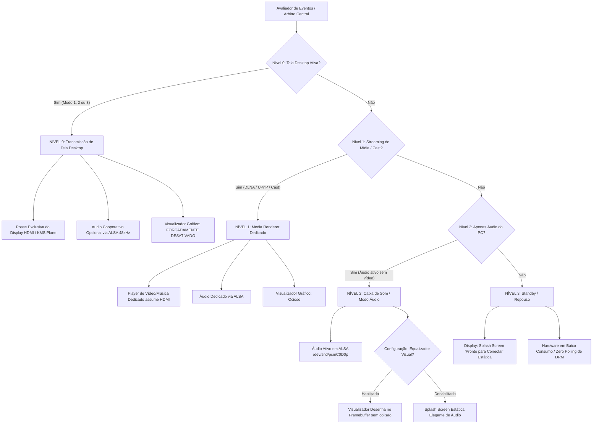

# Blueprint 34: Hierarquia de Serviços, Árvore de Decisão e Arquitetura em Micro-Blocos

**Status:** Aprovado para Implementação  
**Data:** 03 de Outubro de 2026  
**Autor:** Carlos Alberto & Antigravity AI  
**Alvo:** Raspberry Pi Zero W (ARMv6) / Zero 2 W (ARMv8) / Host PC (Linux/Windows)  

---

## 1. Contexto e Motivação do Problema

Durante os testes empíricos de alternância entre os modos operacionais (Modo 3 USB Bulk, Modo 1 Rede UDP, Modo 2 Miracast e Modo Áudio), foi diagnosticada uma colisão de recursos no subsistema gráfico do receptor:
1. **Colisão de Posse do HDMI (DRM Master):** No driver `vc4-drm`, apenas um file descriptor pode deter o status de `DRM Master`. Ao comutar serviços, se o processo de vídeo anterior não liberar formalmente o plano KMS ou se o motor de visualização de áudio (`VisualizerEngine`) tentar escrever no `/dev/fb0` enquanto o decoder V4L2 M2M aloca o plano KMS (Plane 86 no CRTC 97), ocorre a falha `Plane update failed (Permission denied (os error 13))`. O decodificador cai para framebuffer de emulação, mas o plano KMS da tela anterior fica congelado na frente, deixando a tela sem atualização de imagem enquanto o áudio continua tocando.
2. **Looping Visualizador vs Tela de Aviso:** Quando o áudio do host continuava chegando com vídeo em pausa, o visualizador de espectro entrava em looping entre a renderização das barras e a tela de aviso de serviço a cada corte de silêncio (> 800 ms).
3. **Necessidade de Desacoplamento Estrito:** Serviços distintos (transmissão de tela de desktop, streaming de mídia DLNA/Cast, streaming de áudio avulso e tela de espera) precisam operar sob uma **árvore de decisão determinística e hierárquica**, onde recursos exclusivos são arbitrados sem colisões e recursos cooperativos (como áudio tocando durante vídeo) operam sem acoplamento monolítico.

---

## 2. A Hierarquia de Serviços (Níveis 0 a 4)

O sistema adota uma árvore de decisão estrita de 4 níveis de prioridade sobre os periféricos do hardware:



### Especificação dos Níveis:

* **Nível 0: Modos de Tela Principal (Full Desktop Video Extension/Clone)**
  * **Modos:** Modo 3 (USB Bulk Direct), Modo 1 (Rede UDP 5000), Modo 2 (Miracast WFD 7236).
  * **Prioridade de Vídeo:** **MÁXIMA (Exclusiva)**. O decodificador V4L2 M2M e o apresentador KMS têm posse total do CRTC 97 e Plane 86.
  * **Comportamento Gráfico:** NENHUM visualizador, equalizador ou splash screen pode tentar acessar `/dev/dri/card0` nem `/dev/fb0`.
  * **Comportamento de Áudio:** Cooperativo. O áudio do desktop toca perfeitamente sincronizado a 48.000 Hz sem interferir no vídeo.

* **Nível 1: Streaming de Mídia / Cast (Sem tela desktop)**
  * **Protocolos:** Google Cast V2, UPnP / DLNA AVTransport, DIAL.
  * **Condição:** Só é ativado quando o Nível 0 estiver inativo (`None`).
  * **Comportamento:** O media player assume o renderizador de vídeo e áudio dedicado.

* **Nível 2: Áudio Isolado do Notebook (Modo Caixa de Som HDMI)**
  * **Cenário:** O usuário envia áudio do notebook (música, reunião, podcast) sem estender nem clonar a tela de vídeo.
  * **Comportamento de Áudio:** Áudio PCM 48 kHz estéreo ativo no ALSA `/dev/snd/pcmC0D0p`.
  * **Comportamento de Vídeo:** A tela HDMI não fica piscando nem alternando. Ela exibe ou a Splash Screen estática indicando áudio ativo, ou (se o usuário explicitamente habilitar via `/api/media/visualizer {"enabled":true}`) o equalizador de espectro FFT fluido, sem cair em tela de aviso a cada milissegundo de pausa.

* **Nível 3: Standby / Repouso**
  * **Cenário:** Nenhum stream de vídeo e nenhum pacote de áudio trafegando.
  * **Comportamento:** Exibição da Splash Screen quadrilíngue estática ("Pronto para Conectar"), liberando o processador para menos de 1% de uso.

---

## 3. Matriz DE-PARA de Recursos Compartilhados vs Exclusivos

| Recurso de Hardware | Modo de Posse | Nível 0 (Tela Desktop) | Nível 1 (Media Cast) | Nível 2 (Áudio PC) | Nível 3 (Standby) | Procedimento de Desacoplamento / Handshake |
| :--- | :--- | :--- | :--- | :--- | :--- | :--- |
| **HDMI Display (`/dev/dri/card0`, KMS Plane 86)** | **Exclusivo** | **Posse Total** (V4L2 M2M DMA-BUF) | **Posse Total** (Media Player) | Liberado para Framebuffer | Liberado para Splash | O proprietário anterior executa `release()` atômico antes de transferir a posse, evitando `os error 13 (Permission denied)`. |
| **HDMI Framebuffer (`/dev/fb0`)** | **Exclusivo** | Desativado (evita colisão com KMS) | Desativado | Ativo (Splash ou Visualizer) | Ativo (Splash Estática) | Bloqueado por Mutex durante Nível 0 para impedir concorrência com o KMS Plane. |
| **HDMI Áudio (`/dev/snd/pcmC0D0p`)** | **Compartilhado / Cooperativo** | Ativo (Áudio do PC sincronizado) | Ativo (Áudio do Cast/Mídia) | Ativo (Áudio do PC) | Em repouso (pre-warmed) | Thread de áudio independente consome UDP 5004 sem acoplamento com o renderizador de vídeo. |
| **USB Bulk (`/dev/usb-ffs/display`)** | **Exclusivo de Ingress** | Ativo no Modo 3 | Inativo | Inativo | Inativo | Fechamento limpo do worker thread sem derrubar o UDC gadget. |
| **Rede CDC-ECM (`usb0` 192.168.7.2)** | **Compartilhado Permanente** | Ativo (Dashboard/API/Áudio) | Ativo (Dashboard/API/Áudio) | Ativo (Dashboard/API/Áudio) | Ativo (Dashboard/API) | Sempre online, nunca derrubado por comutação de vídeo. |
| **API REST / Swagger (:8080)** | **Compartilhado Permanente** | Ativo para controle | Ativo para controle | Ativo para controle | Ativo para controle | Central de comutação e telemetria em tempo real. |

---

## 4. Arquitetura em Micro-Blocos Isolados

Para evitar monoblocos de código e assegurar manutenção limpa, alta testabilidade unitária e rastreabilidade total, cada responsabilidade é isolada em seu próprio arquivo correspondente ao fluxo de dados:

```
receiver/src/flow/
├── mod.rs                        # Registro e orquestração dos micro-blocos
├── flow_hierarchy.rs             # Árbitro Central e Máquina de Estados de Prioridade (Nível 0..3)
├── flow_arbiter.rs               # Controle atômico de posse exclusiva do Display HDMI / KMS Plane
├── ingress_usb_bulk.rs           # Micro-bloco: Recepção de pacotes FunctionFS USB Bulk (Modo 3)
├── ingress_network_udp.rs        # Micro-bloco: Recepção de pacotes RTP H.264 UDP porta 5000 (Modo 1)
├── ingress_miracast.rs           # Micro-bloco: Recepção e demux RTSP/WFD porta 7236 (Modo 2)
├── codec_v4l2_m2m.rs             # Micro-bloco: Decodificação acelerada por hardware VideoCore IV
├── display_kms_plane.rs          # Micro-bloco: Scanout direto DMA-BUF no plano KMS (Zero-Copy)
├── display_framebuffer.rs        # Micro-bloco: Gerenciador de /dev/fb0 e Splash Screens
├── display_visualizer.rs         # Micro-bloco: Equalizador gráfico (ativo apenas em Nível 2)
├── audio_alsa_hdmi.rs            # Micro-bloco: Renderizador ALSA HDMI IEC958 / 48 kHz
└── audio_spectrum.rs             # Micro-bloco: Processamento FFT e telemetria de espectro
```

E no transmissor (`sender/src/flow/`):
```
sender/src/flow/
├── mod.rs                        # Registro dos micro-blocos do transmissor
├── capture_kms_direct.rs         # Micro-bloco: Captura direta do kernel DRM/KMS
├── capture_pipewire.rs           # Micro-bloco: Captura via PipeWire / GNOME Mutter
├── encoder_vaapi.rs              # Micro-bloco: Codificador H.264 acelerado por hardware
├── egress_usb_bulk.rs            # Micro-bloco: Transmissor USB Bulk de alto rendimento
├── egress_network_udp.rs         # Micro-bloco: Transmissor RTP UDP porta 5000
└── audio_streamer_native.rs      # Micro-bloco: Gravador nativo PulseAudio e streamer UDP 5004
```

---

## 5. Garantia de Qualidade e Critérios de Aceite

1. **Compilação e Tipagem:** Código em Rust padrão 2021 sem warnings críticos, compilando nativamente para `x86_64` (host) e cross-compilando para `arm-unknown-linux-musleabihf` (Pi Zero ARMv6).
2. **Testes Unitários:** 100% de cobertura nos avaliadores de transição de estado da hierarquia de serviços (`flow_hierarchy_tests.rs`), provando que:
   - Nível 0 sempre suprime o visualizador gráfico e a tela de aviso.
   - Nível 2 permite áudio contínuo sem transições bruscas de tela.
   - Comutações entre Modo 3 e Modo 1 ocorrem sem duplicar DRM Master.
3. **Regra Máxima:** "Zero Code Edits for Routine Operations". Nenhuma operação de rotina deve exigir edição em tempo de execução; tudo deve operar deterministicamente por CLI e REST API.
