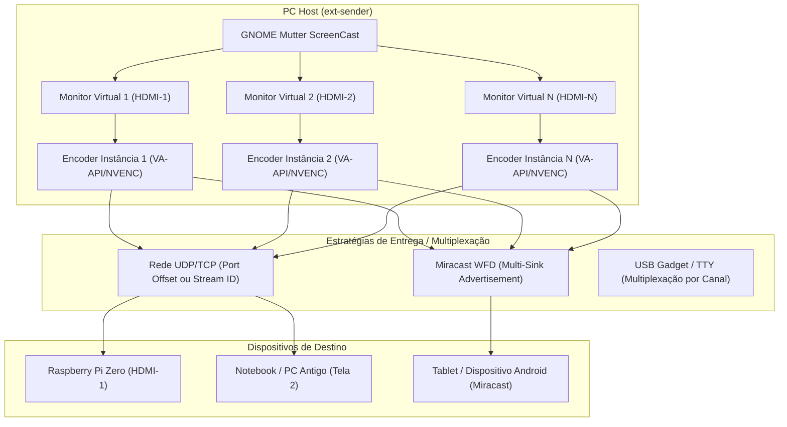

# Especificação de Arquitetura: Multi-Telas & PC como Segunda Tela Remota (Reversibilidade Universal)

**Data:** 25 de Setembro de 2026  
**Status:** Planejado / Aprovado para Implementação Futura  
**Autor:** Carlos Alberto & Equipe de Engenharia Antigravity  

---

## 1. Visão Geral e Motivação

Atualmente, o projeto `ext-monitor` opera primariamente no sentido:
$$\text{PC Host (Wayland/GNOME)} \xrightarrow{\text{H.264}} \text{Raspberry Pi Zero (Display Físico HDMI)}$$

A nova visão estratégica introduz duas extensões fundamentais:
1. **Reversibilidade Universal (Qualquer PC como Tela Remota):** Permitir que qualquer computador antigo, notebook ou mini-PC (Linux x86_64/ARM, Windows ou macOS) execute o `ext-receiver` e atue como monitor secundário de altíssimo desempenho (< 20 ms).
2. **Suporte Multi-Monitores (1 a $N$ Telas Simultâneas):** Capacidade de o host criar múltiplos monitores virtuais independentes e transmiti-los para diferentes receptores (ou janelas dedicadas em um mesmo receptor), seja via Miracast, Rede Local ou USB.

---

## 2. Arquitetura Multi-Telas (1 a $N$ Monitores)



### 2.1. Estratégias de Multiplexação e Endereçamento

Para suportar múltiplas telas sem conflitos de portas:

#### A. Modo Rede (UDP RTP / TCP)
* **Abordagem 1: Port Offset (Isolamento Total):**
  * Tela 1: Vídeo `UDP 5000`, Controle Web/API `8080`, RTSP `7236`
  * Tela 2: Vídeo `UDP 5002`, Controle Web/API `8081`, RTSP `7237`
  * Tela $N$: Vídeo `UDP 5000 + 2*(N-1)`, Controle `8080 + (N-1)`
  * *Vantagem:* Simplicidade absoluta, compatibilidade com qualquer cliente padrão de streaming.
* **Abordagem 2: Multiplexação por SSRC / Stream ID:**
  * Uso de um único socket UDP (`porta 5000`), onde cada monitor possui um SSRC RTP distinto:
    * `SSRC 0x11223301` = Display 1
    * `SSRC 0x11223302` = Display 2
  * O receptor subscreve o stream ID desejado ou abre janelas separadas para cada display.

#### B. Modo Miracast (Wi-Fi Display - WFD)
* O daemon Miracast no receptor ou host anuncia múltiplos *Sinks* Wi-Fi Direct:
  * `"ext-monitor Display 1 (Workspace Principal)"`
  * `"ext-monitor Display 2 (Secundário)"`
* O Windows (atalho `Win + K`) ou Android enxerga ambos os monitores na lista de conexões e conecta de forma independente.

#### C. Modo USB / TTY Serial
* **Multiplexação por Cabeçalho de Canal (COBS Frame):**
  * Cada pacote no canal USB/TTY possui um cabeçalho compacto de 2 bytes:
    `[0xAA, Channel_ID (1..N), Payload_Len (u16), Data...]`
  * Permite enviar comandos de telemetria, eventos de mouse/teclado e múltiplos fluxos de tela no mesmo enlace físico.

---

## 3. PC como Receptor de Segunda Tela (Bilateral / Universal)

Para que qualquer PC (e não apenas o Raspberry Pi Zero) atue como tela secundária, o `ext-receiver` é projetado com suporte multi-backend modular:

```text
                  ext-receiver (Binário Único)
                               │
       ┌───────────────────────┼────────────────────────┐
       ▼                       ▼                        ▼
[Linux Pi Zero]        [Linux Desktop PC]       [Windows / macOS]
V4L2 M2M Hardware      VA-API / NVDEC Dec       SDL2 / D3D11 / Metal
KMS Direct Display     Wayland / X11 Window     Janela Sem Bordas
```

### 3.1. Abstração de Janela e Renderizador
* **Linux (DRM KMS / Wayland):** Decodificação nativa via VA-API / V4L2 M2M e renderização direta em tela cheia (Zero-Copy).
* **Windows (D3D11 / DXGI):** Decodificação via DXVA2 / Direct3D11 Video e exibição em janela *Borderless Fullscreen*.
* **Cross-Platform Fallback:** Interface SDL2 / `wgpu` pura em Rust, permitindo compilar sem nenhuma biblioteca externa pesada.

---

## 4. Diretrizes de Portabilidade e Higiene de Código

Para garantir que o código compile sem nenhum erro em todas as plataformas (ARMv6, ARM64, x86_64, Windows, Linux, macOS):
1. **Compilação Condicional Estrita:**
   * Utilizar `#[cfg(target_os = "linux")]`, `#[cfg(target_arch = "arm")]`, etc., encapsulados em módulos de abstração (`hal/`).
2. **Zero Dependências Host Não-Vendored:**
   * Bibliotecas C proprietárias devem ser carregadas em runtime via `libloading` ou `dlopen`, nunca em link estático que quebre o build no CI/CD.
3. **Rust Edition 2021 Estrita:**
   * Manter `cargo clippy` e `cargo check` com zero warnings em todos os alvos.
